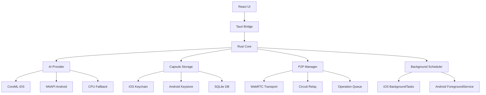

# Design Document - SynapseNet v0.5 Mobile

## Overview

SynapseNet v0.5 brings the decentralized semantic memory network to mobile devices through a Tauri Mobile application. The design focuses on offline-first operation, battery efficiency, and privacy while maintaining full P2P capabilities.

## Architecture

### High-Level Architecture

```
┌─────────────────────────────────────────────────────────┐
│                    Mobile App (Tauri)                    │
├─────────────────────────────────────────────────────────┤
│  React UI Layer                                          │
│  ├─ Home Screen (Status, Stats)                         │
│  ├─ Add Screen (Text/Voice/File Input)                  │
│  ├─ Query Screen (Search, Results)                      │
│  ├─ Peers Screen (Network, Reputation)                  │
│  ├─ Wallet Screen (NGT Balance, Rewards)                │
│  └─ Settings Screen (Models, Privacy, Backup)           │
├─────────────────────────────────────────────────────────┤
│  Tauri Command Bridge (IPC)                             │
│  ├─ syn_init, syn_add, syn_query                        │
│  ├─ syn_stats, syn_peers, syn_wallet                    │
│  └─ syn_export, syn_import, syn_backup                  │
├─────────────────────────────────────────────────────────┤
│  Rust Core (Mobile-Optimized)                           │
│  ├─ Mobile AI Provider (CoreML/NNAPI)                   │
│  ├─ Encrypted Capsule Storage                           │
│  ├─ Mobile P2P Manager (WebRTC/Relay)                   │
│  ├─ Background Task Scheduler                           │
│  └─ Battery/Performance Monitor                         │
├─────────────────────────────────────────────────────────┤
│  Platform Services                                       │
│  ├─ iOS: Keychain, CoreML, BackgroundTasks             │
│  └─ Android: Keystore, NNAPI, ForegroundService        │
└─────────────────────────────────────────────────────────┘
```

### Component Diagram



## Components and Interfaces

### 1. Mobile AI Provider

**Purpose:** Provide on-device AI inference with hardware acceleration.

**Interface:**
```rust
pub trait MobileAIProvider {
    fn detect_capabilities() -> HardwareCapabilities;
    fn load_model(&mut self, model: &str) -> Result<()>;
    fn embed(&self, text: &str) -> Result<Vec<f32>>;
    fn embed_batch(&self, texts: &[String]) -> Result<Vec<Vec<f32>>>;
    fn unload_model(&mut self) -> Result<()>;
}

pub struct HardwareCapabilities {
    pub has_gpu: bool,
    pub has_npu: bool,
    pub supports_coreml: bool,
    pub supports_nnapi: bool,
    pub ram_mb: usize,
}

// iOS Implementation
pub struct CoreMLProvider {
    model: Option<CoreMLModel>,
    capabilities: HardwareCapabilities,
}

// Android Implementation
pub struct NNAPIProvider {
    model: Option<NNAPIModel>,
    capabilities: HardwareCapabilities,
}

// Fallback
pub struct CPUProvider {
    model: Option<OnnxModel>,
}
```

**Auto-Detection Logic:**
```rust
pub fn create_mobile_provider() -> Box<dyn MobileAIProvider> {
    let caps = detect_hardware();
    
    #[cfg(target_os = "ios")]
    if caps.supports_coreml {
        return Box::new(CoreMLProvider::new());
    }
    
    #[cfg(target_os = "android")]
    if caps.supports_nnapi {
        return Box::new(NNAPIProvider::new());
    }
    
    Box::new(CPUProvider::new())
}
```

### 2. Encrypted Memory Capsule

**Purpose:** Secure local storage with device-level encryption.

**Interface:**
```rust
pub struct MemoryCapsule {
    db: Connection,
    encryption_key: EncryptionKey,
    keystore: Box<dyn KeyStore>,
}

pub trait KeyStore {
    fn store_key(&self, key: &[u8]) -> Result<()>;
    fn retrieve_key(&self) -> Result<Vec<u8>>;
    fn delete_key(&self) -> Result<()>;
    fn requires_biometric(&self) -> bool;
}

impl MemoryCapsule {
    pub fn new(keystore: Box<dyn KeyStore>) -> Result<Self>;
    pub fn insert_grain(&mut self, grain: &Grain) -> Result<()>;
    pub fn get_grain(&self, id: &[u8; 32]) -> Result<Option<Grain>>;
    pub fn search_local(&self, query: &[f32], k: usize) -> Result<Vec<SearchResult>>;
    pub fn export_encrypted(&self, path: &Path) -> Result<()>;
    pub fn import_encrypted(&mut self, path: &Path, recovery_phrase: &str) -> Result<()>;
}
```

**Encryption Flow:**
```
1. App Init:
   - Retrieve key from Keychain/Keystore
   - If not exists, generate new key
   - Derive encryption key using HKDF
   
2. Store Grain:
   - Serialize grain to bytes
   - Encrypt with AES-256-GCM (key + random nonce)
   - Store encrypted blob + nonce in SQLite
   
3. Retrieve Grain:
   - Load encrypted blob + nonce from SQLite
   - Decrypt with AES-256-GCM
   - Deserialize to Grain struct
```

**Recovery Phrase:**
```rust
pub struct RecoveryPhrase {
    words: [String; 12],
}

impl RecoveryPhrase {
    pub fn generate() -> Self;
    pub fn to_seed(&self) -> [u8; 64];
    pub fn derive_key(&self) -> EncryptionKey;
    pub fn encrypt_with_kyber(&self, public_key: &[u8]) -> Vec<u8>;
    pub fn decrypt_with_kyber(&self, ciphertext: &[u8], secret_key: &[u8]) -> Result<EncryptionKey>;
}
```

### 3. Mobile P2P Manager

**Purpose:** Handle P2P networking with mobile constraints.

**Interface:**
```rust
pub struct MobileP2PManager {
    swarm: Swarm<SynapseNetBehaviour>,
    operation_queue: VecDeque<P2POperation>,
    network_state: NetworkState,
    config: MobileP2PConfig,
}

pub struct MobileP2PConfig {
    pub use_webrtc: bool,
    pub use_relay: bool,
    pub max_peers: usize,
    pub batch_interval: Duration,
    pub cellular_limit_mbps: f32,
}

pub enum NetworkState {
    Offline,
    WiFi,
    Cellular,
}

impl MobileP2PManager {
    pub fn new(config: MobileP2PConfig) -> Result<Self>;
    pub fn connect(&mut self) -> Result<()>;
    pub fn disconnect(&mut self);
    pub fn queue_operation(&mut self, op: P2POperation);
    pub fn process_queue(&mut self) -> Result<()>;
    pub fn get_peers(&self) -> Vec<PeerInfo>;
    pub fn sync_grains(&mut self) -> Result<()>;
}
```

**Transport Priority:**
```
1. WiFi + Direct Connection (QUIC)
2. WiFi + WebRTC
3. WiFi + Circuit Relay
4. Cellular + WebRTC (if enabled)
5. Cellular + Circuit Relay (if enabled)
6. Queue for later (if offline)
```

**Background Behavior:**
```rust
pub enum AppState {
    Foreground,
    Background,
    Suspended,
}

impl MobileP2PManager {
    pub fn on_state_change(&mut self, state: AppState) {
        match state {
            AppState::Foreground => {
                self.connect();
                self.process_queue();
            }
            AppState::Background => {
                self.batch_operations();
                self.reduce_activity();
            }
            AppState::Suspended => {
                self.disconnect();
            }
        }
    }
}
```

### 4. Background Task Scheduler

**Purpose:** Manage background operations efficiently.

**Interface:**
```rust
pub struct BackgroundScheduler {
    tasks: Vec<ScheduledTask>,
    battery_monitor: BatteryMonitor,
    platform: Box<dyn PlatformScheduler>,
}

pub trait PlatformScheduler {
    fn schedule_task(&self, task: &ScheduledTask) -> Result<()>;
    fn cancel_task(&self, id: &str) -> Result<()>;
    fn is_background_allowed(&self) -> bool;
}

pub struct ScheduledTask {
    pub id: String,
    pub interval: Duration,
    pub requires_wifi: bool,
    pub requires_charging: bool,
    pub callback: Box<dyn Fn() -> Result<()>>,
}

impl BackgroundScheduler {
    pub fn schedule_sync(&mut self, interval: Duration);
    pub fn schedule_cleanup(&mut self, interval: Duration);
    pub fn on_battery_change(&mut self, charging: bool);
    pub fn on_network_change(&mut self, state: NetworkState);
}
```

**iOS Implementation:**
```swift
// BGTaskScheduler wrapper
class SynapseNetBackgroundTasks {
    func registerTasks() {
        BGTaskScheduler.shared.register(
            forTaskWithIdentifier: "net.synapse.sync",
            using: nil
        ) { task in
            self.handleSync(task: task as! BGProcessingTask)
        }
    }
    
    func scheduleSync() {
        let request = BGProcessingTaskRequest(identifier: "net.synapse.sync")
        request.requiresNetworkConnectivity = true
        request.requiresExternalPower = false
        try? BGTaskScheduler.shared.submit(request)
    }
}
```

**Android Implementation:**
```kotlin
// ForegroundService for persistent connection
class SynapseNetService : Service() {
    override fun onStartCommand(intent: Intent?, flags: Int, startId: Int): Int {
        val notification = createNotification()
        startForeground(NOTIFICATION_ID, notification)
        
        // Start Rust core
        startSynapseNet()
        
        return START_STICKY
    }
}
```

### 5. Battery and Performance Monitor

**Purpose:** Optimize resource usage based on device state.

**Interface:**
```rust
pub struct PerformanceMonitor {
    battery_level: f32,
    is_charging: bool,
    thermal_state: ThermalState,
    memory_pressure: MemoryPressure,
}

pub enum ThermalState {
    Nominal,
    Fair,
    Serious,
    Critical,
}

pub enum MemoryPressure {
    Normal,
    Warning,
    Critical,
}

impl PerformanceMonitor {
    pub fn should_use_gpu(&self) -> bool {
        self.is_charging && self.thermal_state != ThermalState::Critical
    }
    
    pub fn should_process_queue(&self) -> bool {
        self.battery_level > 0.2 || self.is_charging
    }
    
    pub fn get_batch_size(&self) -> usize {
        match (self.is_charging, self.memory_pressure) {
            (true, MemoryPressure::Normal) => 32,
            (true, _) => 16,
            (false, MemoryPressure::Normal) => 8,
            (false, _) => 4,
        }
    }
}
```

## Data Models

### Mobile-Specific Grain Metadata

```rust
pub struct MobileGrainMeta {
    // Standard fields
    pub author_pk: [u8; 32],
    pub crypto_backend: CryptoBackend,
    pub ts_unix_ms: i64,
    pub tags: Vec<String>,
    
    // Mobile-specific
    pub device_id: String,
    pub created_offline: bool,
    pub sync_status: SyncStatus,
    pub local_only: bool,
}

pub enum SyncStatus {
    NotSynced,
    Syncing,
    Synced,
    Failed(String),
}
```

### Operation Queue

```rust
pub struct P2POperation {
    pub id: Uuid,
    pub op_type: OperationType,
    pub created_at: i64,
    pub retry_count: u32,
    pub requires_wifi: bool,
}

pub enum OperationType {
    PublishGrain(Grain),
    QueryNetwork(String, usize),
    SyncRewards,
    UpdatePeerList,
}
```

## UI Design

### Screen Flow

```
Home Screen
├─ Add Button → Add Screen
│  ├─ Text Input
│  ├─ Voice Input
│  └─ File Import
├─ Search Button → Query Screen
│  ├─ Search Bar
│  └─ Results List
├─ Network Button → Peers Screen
│  ├─ Connected Peers
│  └─ Network Stats
├─ Wallet Button → Wallet Screen
│  ├─ NGT Balance
│  └─ Reward History
└─ Settings Button → Settings Screen
   ├─ Models
   ├─ Privacy
   ├─ Backup
   └─ About
```

### Component Specifications

**Home Screen:**
- Node status indicator (online/offline/syncing)
- Quick stats (grains, peers, rewards)
- Recent activity feed
- Quick action buttons

**Add Screen:**
- Multi-line text input
- Voice recording button
- File picker button
- Tag input
- Submit button with loading state

**Query Screen:**
- Search bar with voice input
- Filter options (tags, date)
- Results list with similarity scores
- Result detail view

**Peers Screen:**
- Connected peers list
- Peer reputation scores
- Network topology visualization
- Connection quality indicators

**Wallet Screen:**
- NGT balance display
- Reward history timeline
- PoE score breakdown
- Export rewards button

**Settings Screen:**
- Model selection
- Privacy toggles (air-gap mode, sharing)
- Backup/restore
- Recovery phrase display
- About/version info

## Error Handling

### Error Categories

```rust
pub enum MobileError {
    // Platform errors
    KeychainError(String),
    BiometricError(String),
    PermissionDenied(String),
    
    // Network errors
    NoConnectivity,
    CellularDisabled,
    RelayUnavailable,
    
    // Storage errors
    StorageFull,
    EncryptionFailed,
    CorruptedData,
    
    // AI errors
    ModelNotFound,
    InferenceFailed,
    UnsupportedHardware,
    
    // User errors
    InvalidRecoveryPhrase,
    InvalidInput(String),
}
```

### Recovery Strategies

```rust
impl MobileError {
    pub fn recovery_action(&self) -> RecoveryAction {
        match self {
            Self::NoConnectivity => RecoveryAction::QueueForLater,
            Self::StorageFull => RecoveryAction::PromptCleanup,
            Self::ModelNotFound => RecoveryAction::OfferDownload,
            Self::BiometricError(_) => RecoveryAction::FallbackToPassword,
            _ => RecoveryAction::ShowError,
        }
    }
}
```

## Testing Strategy

### Unit Tests
- AI provider selection logic
- Encryption/decryption
- Operation queue management
- Battery optimization logic

### Integration Tests
- End-to-end grain creation and search
- P2P sync across devices
- Background task execution
- Recovery phrase backup/restore

### UI Tests
- Screen navigation
- Form validation
- Error message display
- Accessibility features

### Device Tests
- Real device testing (iPhone, Android)
- Battery drain measurement
- Network performance
- Storage usage

### Performance Benchmarks
- App launch time
- Embedding generation speed
- Search latency
- Memory usage
- Battery consumption

## Security Considerations

### Threat Model

**Threats:**
1. Device theft → Encrypted storage + biometric auth
2. Network eavesdropping → Only embeddings transmitted
3. Malicious peers → Signature verification
4. Data loss → Recovery phrase backup
5. App compromise → Keychain/Keystore isolation

### Security Measures

```rust
pub struct SecurityConfig {
    pub require_biometric: bool,
    pub auto_lock_timeout: Duration,
    pub allow_screenshots: bool,
    pub allow_backup: bool,
    pub air_gap_mode: bool,
}
```

## Privacy Design

### Data Minimization

**Never Transmitted:**
- Raw text content
- User identity
- Device information
- Location data

**Transmitted Only:**
- Embeddings (384-dim vectors)
- Signatures (Dilithium5)
- PoE scores
- Timestamps

### User Controls

```rust
pub struct PrivacySettings {
    pub share_grains: bool,
    pub share_queries: bool,
    pub share_rewards: bool,
    pub allow_analytics: bool,
    pub air_gap_mode: bool,
}
```

## Deployment

### Build Process

```bash
# iOS
cd apps/mobile
npm install
cargo tauri ios build --release

# Android
cargo tauri android build --release --target aarch64-linux-android
```

### App Store Submission

**iOS:**
- Xcode project configuration
- App Store Connect setup
- TestFlight beta testing
- Privacy manifest
- App review submission

**Android:**
- Play Console setup
- Internal testing track
- Closed beta testing
- Privacy policy
- Production release

### CI/CD Pipeline

```yaml
# .github/workflows/mobile-release.yml
name: Mobile Release

on:
  push:
    tags:
      - 'v0.5.*'

jobs:
  build-ios:
    runs-on: macos-latest
    steps:
      - uses: actions/checkout@v3
      - name: Build iOS
        run: cargo tauri ios build --release
      - name: Upload to TestFlight
        run: fastlane ios beta

  build-android:
    runs-on: ubuntu-latest
    steps:
      - uses: actions/checkout@v3
      - name: Build Android
        run: cargo tauri android build --release
      - name: Upload to Play Console
        run: fastlane android beta
```

## Performance Targets

| Metric | Target | Measurement |
|--------|--------|-------------|
| App Launch | < 3s | Time to interactive |
| Embedding | < 500ms | Per text on iPhone 12 |
| Search | < 100ms | Local, 1K grains |
| Battery (BG) | < 5% | Per day, idle |
| Battery (FG) | < 20% | Per hour, active use |
| Memory | < 150MB | Typical usage |
| Storage | < 50MB | App + 1 model |

---

**Version:** 0.5.0  
**Status:** Draft  
**Last Updated:** 2024-10-31
